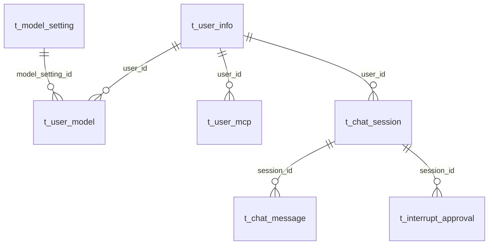
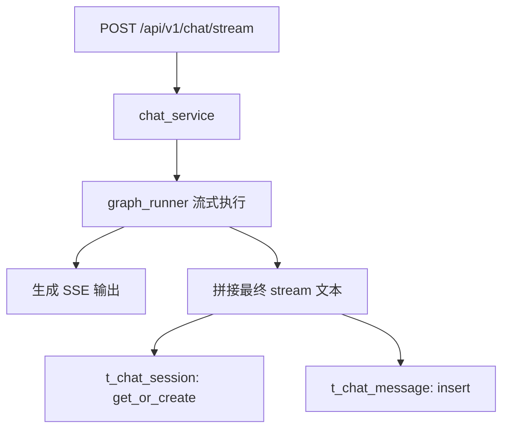
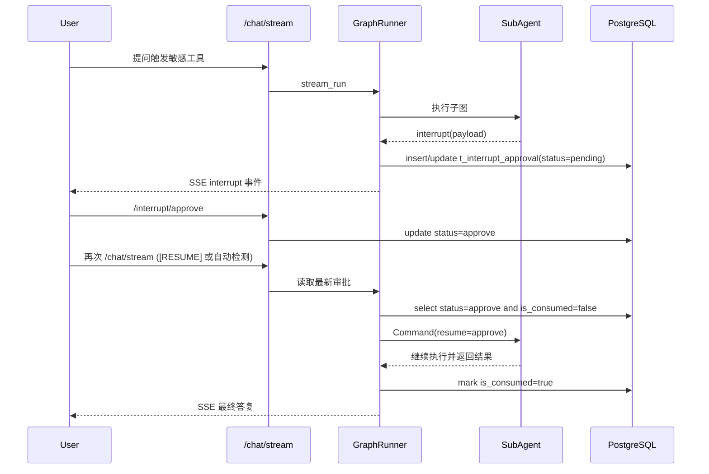

# PostgreSQL 全量技术文档（面向当前项目）

> 文档范围：`xf-ai-agent` 当前仓库中与 PostgreSQL 直接相关的连接、模型、迁移、业务链路、运维与排障。
> 更新时间：2026-03-08

---

## 1. 文档目标与边界

### 1.1 目标

本文件用于回答三个问题：

1. 当前项目里，PostgreSQL 到底承担了哪些职责。
2. 现在有哪些表、字段、索引、约束在生产链路被使用。
3. 如何在生产环境稳定运行、迁移与排障。

### 1.2 边界

包含：

- 运行时 PostgreSQL 主链路（FastAPI + SQLAlchemy + LangGraph 审批持久化）。
- Alembic 迁移链路。
- 历史迁移脚本中与 PG 相关的内容（作为“历史工具”说明）。

不包含：

- MongoDB/Redis 的完整运维手册（仅在“历史迁移脚本”中点到）。

---

## 2. PostgreSQL 在项目中的角色

### 2.1 角色总览

PostgreSQL 在本项目承担以下角色：

1. 业务主数据存储：用户、模型配置、用户模型绑定、MCP 配置。
2. 聊天持久化：会话与消息（`t_chat_session` / `t_chat_message`）。
3. 审批状态仓：LangGraph `interrupt()` 审批请求与结果（`t_interrupt_approval`）。
4. SQL Agent 查询目标：本地 SQL Agent 的数据查询目标库。

### 2.2 技术栈

- ORM/连接层：SQLAlchemy + psycopg2
- 迁移：Alembic
- 特性使用：JSONB、索引、唯一约束、事务回滚

---

## 3. 连接与会话管理

实现文件：`app/db/__init__.py`

### 3.1 连接串来源

- 变量：`POSTGRES_HOST / POSTGRES_PORT / POSTGRES_USER / POSTGRES_PASSWORD / POSTGRES_DB`
- 组装：`SQLALCHEMY_DATABASE_URL = postgresql+psycopg2://...`

### 3.2 连接池参数

- `pool_pre_ping=True`：借连接前探活，减少“连接已断开”异常。
- `pool_recycle=3600`：连接最长保活 1 小时。
- `pool_size=20`
- `max_overflow=30`

### 3.3 会话模式

1. `get_db()`：API 路由依赖注入。
2. `get_db_context()`：Service/后台上下文调用（`with` 语法）。

两者都具备：

- 成功提交 `commit`
- 异常回滚 `rollback`
- 最终关闭 `close`

---

## 4. 全量表清单（当前项目）

> 数据来源：`app/models/*.py` + Alembic 迁移。

1. `t_user_info`
2. `t_model_setting`
3. `t_user_model`
4. `t_user_mcp`
5. `t_chat_session`
6. `t_chat_message`
7. `t_interrupt_approval`

另：历史迁移脚本中出现 `t_sys_cache`，但当前运行时主链路未使用该表。

---

## 5. 表结构与业务含义

### 5.1 `t_user_info`

用途：用户基础信息与登录态 token。

核心字段：

- `id`：主键
- `user_name`：登录用户名
- `nick_name`：昵称
- `phone`：手机号
- `password`：密码哈希
- `token`：令牌（当前实现保留）
- `create_time` / `update_time`

### 5.2 `t_model_setting`

用途：系统级模型服务配置模板。

核心字段：

- `service_name` / `service_type` / `service_url`
- `api_key_template`
- `models`（JSON）
- `is_system_default` / `is_enabled`
- `create_time` / `update_time`

### 5.3 `t_user_model`

用途：用户绑定具体模型配置（可激活一个当前模型）。

核心字段：

- `user_id`
- `model_setting_id`（FK -> `t_model_setting.id`）
- `service_name`
- `selected_model`
- `api_key` / `api_url`
- `custom_config`（JSON）
- `is_active`
- `create_time` / `update_time`

### 5.4 `t_user_mcp`

用途：用户级 MCP 配置。

核心字段：

- `user_id`
- `mcp_setting_json`
- `create_time` / `update_time`

### 5.5 `t_chat_session`

用途：会话主表（每个 `session_id` 唯一）。

核心字段：

- `user_id`
- `session_id`（唯一）
- `title`
- `is_deleted`
- `create_time` / `update_time`

### 5.6 `t_chat_message`

用途：消息流水。

核心字段：

- `user_id`
- `session_id`
- `user_content` / `model_content`
- `model_name`
- `tokens` / `latency_ms`
- `is_deleted`
- `extra_data`（JSONB，可扩展 tool_calls/引用来源）
- `create_time`

### 5.7 `t_interrupt_approval`

用途：审批状态持久化（LangGraph `interrupt()` 关键状态表）。

核心字段：

- `session_id`
- `message_id`
- `action_name` / `action_args`（JSONB）
- `description`
- `status`（`pending/approve/reject`）
- `user_id` / `decision_time`
- `agent_name`
- `subgraph_thread_id`
- `checkpoint_id` / `checkpoint_ns`
- `is_consumed`（是否已被恢复流程消费）
- `create_time` / `update_time`

关键约束与索引：

- 唯一：`(session_id, message_id)`
- 复合索引：`(session_id, status, is_consumed)`
- 时间索引：`create_time`

---

## 6. ER 关系图（核心关系）



说明：

- `t_chat_message` 当前以 `session_id` 逻辑关联会话（非外键约束方式）。
- `t_interrupt_approval` 通过 `session_id + message_id` 实现业务幂等与恢复定位。

---

## 7. 运行时读写链路

### 7.1 聊天落库链路



说明：

- 当前已修复 `stream` 事件提取逻辑，避免“有输出但未入库”导致后续上下文丢失。

### 7.2 审批链路（interrupt 持久化）



---

## 8. 与 LangGraph 的关键绑定点

### 8.1 中断注册

- 位置：`app/agent/graph_runner.py::_register_interrupts`
- 行为：将 `action_requests` 写入 `t_interrupt_approval`，附带 `agent_name/subgraph_thread_id/checkpoint`。

### 8.2 恢复读取

- 位置：`app/services/interrupt_service.py::fetch_latest_resolved_approval`
- 条件：`status in (approve, reject)` 且 `is_consumed=false`

### 8.3 恢复消费标记

- 位置：`app/services/interrupt_service.py::mark_approval_consumed`
- 目的：防重放、防重复恢复。

---

## 9. 迁移策略（当前现状）

### 9.1 双轨现状

1. 应用启动建表：`app/main.py` 中 `Base.metadata.create_all(bind=engine)`
2. Alembic 迁移：已引入并包含首个迁移版本（`t_interrupt_approval`）

### 9.2 生产建议

- 设置：`AUTO_CREATE_TABLES=false`
- 发布前执行：`alembic upgrade head`
- 禁止线上依赖隐式 `create_all`

### 9.3 当前迁移文件

- `alembic/versions/20260308_01_create_t_interrupt_approval.py`

---

## 10. 关键 SQL 运维手册

### 10.1 查看待处理审批

```sql
SELECT id, session_id, message_id, action_name, status, is_consumed, create_time
FROM t_interrupt_approval
WHERE status = 'pending' AND is_consumed = false
ORDER BY create_time DESC;
```

### 10.2 查看可恢复审批

```sql
SELECT id, session_id, message_id, status, decision_time, is_consumed
FROM t_interrupt_approval
WHERE status IN ('approve', 'reject') AND is_consumed = false
ORDER BY decision_time DESC NULLS LAST, update_time DESC;
```

### 10.3 聊天会话与消息核对

```sql
SELECT s.session_id, s.title, s.create_time, COUNT(m.id) AS msg_count
FROM t_chat_session s
LEFT JOIN t_chat_message m ON m.session_id = s.session_id
WHERE s.user_id = :user_id
GROUP BY s.session_id, s.title, s.create_time
ORDER BY s.create_time DESC;
```

### 10.4 最近消息（排查“无最终答复”）

```sql
SELECT id, session_id, model_name, LEFT(model_content, 200) AS content_preview, create_time
FROM t_chat_message
WHERE session_id = :session_id
ORDER BY id DESC
LIMIT 20;
```

---

## 11. 性能与索引建议

### 11.1 已有重点索引

- `t_chat_session.session_id`（唯一）
- `t_chat_message.session_id`
- `t_interrupt_approval(session_id, status, is_consumed)`

### 11.2 建议新增（按实际压测后执行）

1. `t_chat_message(session_id, create_time DESC)`：提升会话消息拉取性能。
2. `t_chat_message(user_id, create_time DESC)`：提升用户维度审计查询。
3. `t_user_model(user_id, is_active)`：提升激活模型查询。

---

## 12. 安全与合规建议

1. `api_key`、`password` 建议迁移到加密存储（字段级脱敏/加密）。
2. 审批表 `action_args` 可能含敏感 SQL，建议日志侧只输出摘要哈希。
3. 聊天消息表建议按保留策略归档（冷热分层）。

---

## 13. 历史迁移脚本说明（非运行时主链路）

文件：`app/db/pgsql/chat_history_db.py`

用途：历史一次性“多源 -> PG”迁移脚本（MySQL/MongoDB/Redis 到 PostgreSQL）。

注意：

- 脚本中有硬编码连接信息，生产不可直接复用。
- 该脚本应归档到 `scripts/legacy` 或仅保留为历史参考。

---

## 14. 配置清单（与 PostgreSQL 直接相关）

### 14.1 连接配置

- `POSTGRES_HOST`
- `POSTGRES_PORT`
- `POSTGRES_USER`
- `POSTGRES_PASSWORD`
- `POSTGRES_DB`

### 14.2 迁移与建表策略

- `AUTO_CREATE_TABLES`

### 14.3 审批/策略/缓存协同配置

- `SQL_LOCAL_TABLE_WHITELIST`
- `SQL_YUNYOU_TABLE_WHITELIST`
- `SEMANTIC_CACHE_TTL_SECONDS`
- `SEMANTIC_CACHE_MAX_SIZE`

---

## 15. 上线与回滚清单（PG 视角）

### 15.1 上线前

1. 备份数据库（全量 + 最近增量）。
2. 执行 `alembic upgrade head`。
3. 验证关键表是否存在（7 张主表）。
4. 验证审批链路：`pending -> approve -> consumed`。

### 15.2 回滚策略

1. 若迁移失败：回滚应用版本 + 恢复数据库快照。
2. 若仅业务异常：保留新表，按应用逻辑热修复，避免数据回退丢失审批记录。

---

## 16. 常见故障与排查

### 16.1 审批已点“批准”但恢复失败

检查：

1. `t_interrupt_approval` 对应记录是否 `status=approve`。
2. `is_consumed` 是否提前变为 `true`。
3. `subgraph_thread_id/checkpoint_id/checkpoint_ns` 是否为空。

### 16.2 看不到最终答复

检查：

1. SSE 是否有 `stream` 事件。
2. `t_chat_message.model_content` 是否写入。
3. 若只有 thinking 无 stream，检查 `graph_runner` 输出过滤逻辑。

### 16.3 查询慢

检查：

1. 是否命中 `session_id`、`status` 等索引。
2. 是否存在大范围全表扫描。
3. `pool_size/max_overflow` 是否匹配并发量。

---

## 17. 参考文件索引

- `app/db/__init__.py`
- `app/models/user_info.py`
- `app/models/model_setting.py`
- `app/models/user_model.py`
- `app/models/user_mcp.py`
- `app/models/chat_history.py`
- `app/models/interrupt_approval.py`
- `app/services/interrupt_service.py`
- `app/main.py`
- `alembic/env.py`
- `alembic/versions/20260308_01_create_t_interrupt_approval.py`
- `docs/Alembic迁移指南.md`
- `docs/PostgreSQL持久化设计与运维文档.md`

