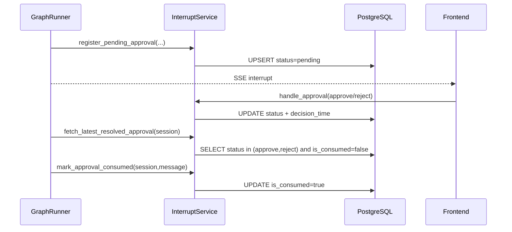

# PostgreSQL 持久化设计与运维文档

> 适用项目：`xf-ai-agent`  
> 更新时间：2026-03-08  
> 文档目标：说明本项目如何使用 PostgreSQL 承载业务数据与审批状态（替代 Redis 方案）

---

## 1. 文档范围

本文覆盖：

1. 本项目 PostgreSQL 在系统中的角色。
2. 关键表（含新引入的 `t_interrupt_approval`）设计。
3. 审批持久化链路（register -> approve -> resume -> consumed）。
4. 索引、排障、运维建议。
5. 生产环境参数与容量建议。

---

## 2. PostgreSQL 在本项目中的定位

当前 PostgreSQL 同时承担两类职责：

1. 核心业务库：用户、模型配置、会话与消息历史。
2. 审批状态仓：人工审批请求与恢复元数据持久化。

这样做的目的：

1. 避免审批状态仅在进程内存中，重启即丢失。
2. 避免引入 Redis 的额外运维复杂度，在现阶段用 PG 即可满足一致性与可恢复需求。

---

## 3. 连接与会话配置

代码位置：`app/db/__init__.py`

主要配置项：

1. `POSTGRES_HOST`
2. `POSTGRES_PORT`
3. `POSTGRES_USER`
4. `POSTGRES_PASSWORD`
5. `POSTGRES_DB`

引擎参数（当前）：

1. `pool_pre_ping=True`
2. `pool_recycle=3600`
3. `pool_size=20`
4. `max_overflow=30`

建议：

1. 线上按实例并发能力调整 `pool_size/max_overflow`。
2. 对慢 SQL 开启日志与分析（`pg_stat_statements`）。

---

## 4. 核心数据表

### 4.1 业务主表（摘要）

1. `t_user_info`
2. `t_model_setting`
3. `t_user_model`
4. `t_user_mcp`
5. `t_chat_session`
6. `t_chat_message`

### 4.2 审批状态表（新增）

表名：`t_interrupt_approval`  
模型位置：`app/models/interrupt_approval.py`

字段说明：

| 名称 | 哪个包的 | 作用 | 详细说明 |
|---|---|---|---|
| `id` | `t_interrupt_approval` | 主键 | Bigint 自增 |
| `session_id` | `t_interrupt_approval` | 会话维度 | 与聊天会话绑定，恢复时按会话读取 |
| `message_id` | `t_interrupt_approval` | 审批消息标识 | 与前端审批卡片绑定，支持精确命中 |
| `action_name` | `t_interrupt_approval` | 操作名 | 被审批工具名（如 `execute_sql`） |
| `action_args` | `t_interrupt_approval` | 操作参数 | JSONB，保留原始工具入参 |
| `description` | `t_interrupt_approval` | 审批说明 | 展示给用户/审计用途 |
| `status` | `t_interrupt_approval` | 审批状态 | `pending/approve/reject` |
| `user_id` | `t_interrupt_approval` | 审批人 | 谁执行了审批 |
| `decision_time` | `t_interrupt_approval` | 审批时间 | 何时 approve/reject |
| `agent_name` | `t_interrupt_approval` | 源 Agent | 哪个子 Agent 触发审批 |
| `subgraph_thread_id` | `t_interrupt_approval` | 子图线程ID | LangGraph 恢复定位字段 |
| `checkpoint_id` | `t_interrupt_approval` | 检查点ID | 恢复精确定位 |
| `checkpoint_ns` | `t_interrupt_approval` | 检查点命名空间 | 恢复精确定位 |
| `is_consumed` | `t_interrupt_approval` | 消费标志 | 审批结果是否已被 `[RESUME]` 消费 |
| `create_time` | `t_interrupt_approval` | 创建时间 | 记录创建时间 |
| `update_time` | `t_interrupt_approval` | 更新时间 | 自动更新 |

约束与索引：

1. `UNIQUE(session_id, message_id)`
2. `idx_interrupt_session_status_consumed(session_id, status, is_consumed)`
3. `idx_interrupt_create_time(create_time)`

---

## 5. 审批持久化链路

### 5.1 时序图



### 5.2 设计要点

1. `status` 表示审批结果。
2. `is_consumed` 表示恢复流程是否已消费该结果。
3. 只有 `status in (approve,reject)` 且 `is_consumed=false` 会触发恢复。
4. 恢复成功或终止后必须 `mark_approval_consumed`，防止重复恢复。

---

## 6. 关键 SQL（排障常用）

### 6.1 查看会话最近审批记录

```sql
SELECT id, session_id, message_id, action_name, status, is_consumed, decision_time, create_time, update_time
FROM t_interrupt_approval
WHERE session_id = :session_id
ORDER BY id DESC
LIMIT 20;
```

### 6.2 查看待恢复记录

```sql
SELECT id, session_id, message_id, action_name, status, is_consumed, decision_time
FROM t_interrupt_approval
WHERE session_id = :session_id
  AND status IN ('approve', 'reject')
  AND is_consumed = false
ORDER BY decision_time DESC NULLS LAST, update_time DESC, id DESC
LIMIT 1;
```

### 6.3 检查“审批后无法恢复”

```sql
SELECT *
FROM t_interrupt_approval
WHERE session_id = :session_id
  AND message_id = :message_id;
```

判断逻辑：

1. `status` 还是 `pending`：前端审批没成功写库。
2. `status=approve/reject` 且 `is_consumed=true`：已经被消费，不会再次恢复。
3. 无记录：中断注册阶段失败，需查 `register_pending_approval` 日志。

---

## 7. 部署与初始化

### 7.1 当前初始化机制

当前项目通过 `Base.metadata.create_all(bind=engine)` 在启动时建表。  
优点：快速。  
风险：生产变更不可控。

### 7.2 生产建议

1. 引入 Alembic 管理迁移。
2. 新表变更走版本化脚本，不在业务启动时自动建表。
3. 对 `t_interrupt_approval` 增加归档/清理策略。
4. 可直接参考 SQL 脚本：`docs/sql/20260308_create_t_interrupt_approval.sql`。

---

## 8. 运维策略

### 8.1 数据清理建议

1. `pending` 且超长时间未处理（如 >7 天）可告警。
2. `is_consumed=true` 的历史数据可定期归档或清理（如保留 30~90 天）。

示例清理 SQL：

```sql
DELETE FROM t_interrupt_approval
WHERE is_consumed = true
  AND update_time < NOW() - INTERVAL '90 days';
```

### 8.2 监控建议

建议监控指标：

1. 每分钟新增审批量。
2. 审批通过率/拒绝率。
3. 审批后恢复成功率。
4. 长时间 `pending` 数量。

---

## 9. 常见问题

### 9.1 为什么不用 Redis？

当前阶段 PG 已经可满足：

1. 强一致持久化。
2. 审批体量相对可控。
3. 降低额外基础设施复杂度。

后续若审批吞吐显著增加，再拆分 Redis/消息队列。

### 9.2 如果 PG 暂时不可用怎么办？

代码里保留了内存兜底：

1. 写 PG 失败时降级写内存。
2. 读 PG 失败时降级读内存。

但生产仍应优先保证 PG 可用性，避免跨实例时内存态不一致。

---

## 10. 结论

审批链路已经从“进程内临时状态”升级为“PostgreSQL 持久化状态机”：

1. 能抗服务重启。
2. 能做审计追踪。
3. 能通过 `is_consumed` 防止重复恢复。

这是当前项目在不引入 Redis 的前提下，最稳妥、最可落地的生产化方案。
