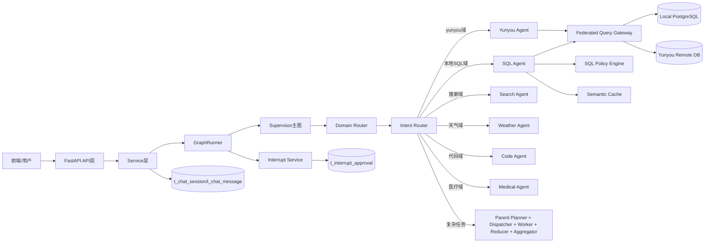
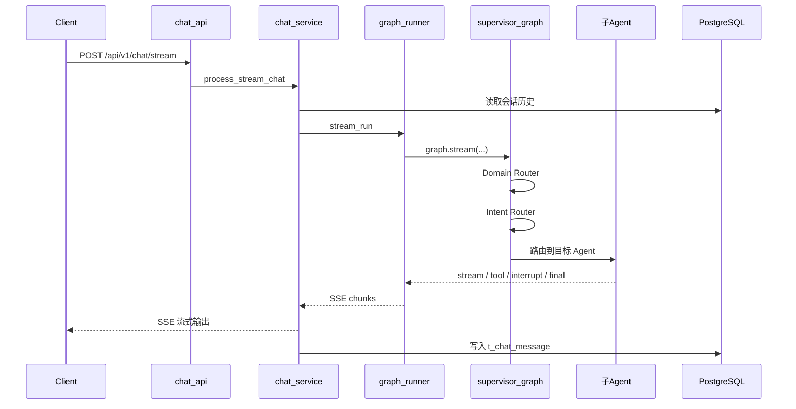
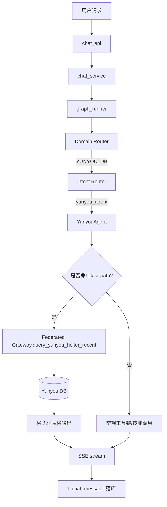

# 后端项目说明文档（生产级详细版）

> 项目：`xf-ai-agent`
> 文档目标：让新同学/小白也能完整理解系统架构、执行流程、关键技术、可扩展路线与上线要点。
> 更新时间：2026-03-08

---

## 1. 项目定位

这是一个基于 **FastAPI + LangGraph + 多 Agent 协作** 的智能后端系统，核心能力是：

1. 接收用户问题并流式返回答案（SSE）。
2. 通过“数据域路由 + 意图路由 + DAG 编排”选择最合适的 Agent 执行。
3. 对高风险操作走 **人工审批 interrupt()** 链路。
4. 将聊天历史、审批状态等关键信息持久化到 PostgreSQL。

---

## 2. 总体架构图

---

## 3. 目录与模块职责

### 3.1 API 层

路径：`app/api/v1/*`

- `chat_api.py`：聊天流接口入口。
- `interrupt_api.py`：审批通过/拒绝接口。
- `metrics_api.py`：路由指标与缓存快照。

### 3.2 Service 层

路径：`app/services/*`

- `chat_service.py`：请求编排、历史读取、SSE 流转、消息落库。
- `interrupt_service.py`：审批状态持久化与恢复消费。
- `route_metrics_service.py`：路由命中率/误路由估算埋点。
- `semantic_cache_service.py`：语义缓存。

### 3.3 Agent 图层

路径：`app/agent/*`

- `graph_runner.py`：Supervisor 与子 Agent 的统一执行器。
- `graphs/supervisor.py`：Domain Router、Intent Router、DAG 编排。
- `agents/*.py`：各业务 Agent 子图。
- `gateway/federated_query_gateway.py`：多数据源统一网关。
- `policy/sql_policy_engine.py`：SQL 安全策略中心。

### 3.4 数据层

- `app/db/__init__.py`：连接池与会话。
- `app/models/*.py`：ORM 模型。
- `alembic/*`：迁移管理。

---

## 4. 请求处理主流程（从开始到结束）

---

## 5. 路由体系详解

### 5.1 第一层：Domain Router（数据域路由）

位置：`supervisor.py::domain_router_node`

目标：先判断“查哪类数据域”，避免跨域误查。

数据域：

- `YUNYOU_DB`：云柚/holter 业务域
- `LOCAL_DB`：本地 PostgreSQL 业务域
- `WEB_SEARCH`：互联网检索域
- `GENERAL`：通用对话域

判定策略：

1. 规则优先（关键字直接命中）。
2. Follow-up 场景继承上轮上下文。
3. LLM 分类兜底。
4. 全量埋点到 `route_metrics_service`。

### 5.2 第二层：Intent Router（意图路由）

位置：`supervisor.py::intent_router_node`

目标：在域内选择具体 Agent，尽量减少无意义追问。

关键规则：

1. 若 Domain 已确定为 `YUNYOU_DB`，优先 `yunyou_agent`。
2. 若 `LOCAL_DB` 且语义明显是 SQL，优先 `sql_agent`。
3. 若 `WEB_SEARCH`，优先 `search_agent/weather_agent`。
4. 对补充参数短句（如“最近7天”“按id倒序前5条”）继承历史意图。

### 5.3 第三层：DAG 编排（复杂任务）

位置：`Parent_Planner_Node + dispatcher_node + worker_node + reducer_node + aggregator_node`

用于多步骤复杂任务拆解与并行执行。

---

## 6. 人工审批链路（LangGraph 原生 interrupt）

### 6.1 触发

- SQL Agent/Code Agent/Yunyou 敏感工具在执行前调用 `interrupt(payload)`。

### 6.2 持久化

- `graph_runner` 捕获中断后调用 `interrupt_service.register_pending_approval`。
- 记录写入 `t_interrupt_approval`，状态 `pending`。

### 6.3 审批

- 前端调用审批接口写入 `approve/reject`。

### 6.4 恢复

- 下次聊天请求中，`graph_runner` 检测可恢复审批并执行 `Command(resume=...)`。
- 恢复完成后，标记 `is_consumed=true` 防止重复消费。

---

## 7. 数据与存储设计

### 7.1 PostgreSQL（主存储）

核心表：

- `t_user_info`
- `t_model_setting`
- `t_user_model`
- `t_user_mcp`
- `t_chat_session`
- `t_chat_message`
- `t_interrupt_approval`

详细请看：`docs/PostgreSQL全量文档.md`

### 7.2 语义缓存

- 当前实现为内存缓存（`semantic_cache_service`）。
- 缓存键：`domain + normalized_sql_hash`
- 后续可升级到 PostgreSQL 物化缓存或独立缓存服务。

---

## 8. 关键技术与在项目中的作用

1. **FastAPI**：HTTP API 与 SSE 流式输出。
2. **LangGraph**：多节点图编排、interrupt/resume。
3. **LangChain**：模型与工具调用抽象。
4. **SQLAlchemy**：ORM + 事务管理。
5. **Alembic**：数据库结构版本化迁移。
6. **PostgreSQL JSONB**：可扩展字段（`extra_data`、`action_args`）。
7. **中间件机制**：动态模型加载、请求耗时、统一日志。

---

## 9. 完整流程编排示例（生产案例）

> 场景：用户问“查询 holter 最近使用的用户有哪些，按 id 倒序前 5 条”。

### 9.1 编排图

### 9.2 执行说明（文字版）

1. Domain Router 命中 `YUNYOU_DB`（由 holter 关键词触发）。
2. Intent Router 选择 `yunyou_agent`。
3. YunyouAgent 先尝试 `_try_direct_holter_list_query` 快路径：
   - 无需强制追问日期；
   - 直接调用网关查远端表 `t_holter_use_record`。
4. 查询结果进入格式化函数，输出用户可读表格，而不是裸 JSON。
5. GraphRunner 以 SSE `stream` 推送。
6. ChatService 汇总 `stream` 内容并落库到 `t_chat_message`。

### 9.3 失败分支

- 远端 DB 不可用：回退云柚 API。
- 仍失败：输出可读错误，明确提示重试与排查方向。

---

## 10. 你关心的几个“为什么”

### 10.1 为什么之前会“只显示思考过程，没有最终答复”？

典型原因：

1. 流式过滤过严，只放行某类消息名。
2. 中断恢复后只有状态事件，没有正文透传。

当前修复：

- 放开专业 Agent 正文流白名单。
- 增加错误与超时兜底，避免前端静默。

### 10.2 为什么会“问云柚却查本地表”？

典型原因：

- 先意图路由再数据域判定，SQL 关键词把请求误拉到本地 SQL Agent。

当前修复：

- 先 Domain Router 再 Intent Router。
- 对 holter 语义做强约束优先路由。

### 10.3 为什么会“日期偏移”？

典型原因：

- 某些节点没有统一注入“今天/明天”基准日期。

当前修复：

- 每次 Agent 执行前注入 `get_agent_date_context()`。
- 主图入口同样注入日期上下文。

---

## 11. 生产化扩展路线（与你当前规划对齐）

### 11.1 阶段一：Domain Router（已落地）

- 先分域再分 Agent。
- 增加路由命中与误路由指标。

### 11.2 阶段二：Federated Query Gateway（已落地骨架）

- 统一多数据源调用协议。
- Agent 不直接关心连接细节。

### 11.3 阶段三：Semantic Cache + Policy Engine（已落地首版）

- SQL 高频查询缓存。
- SQL 只读约束 + 表白名单策略中心。

---

## 12. 配置清单（后端关键）

- `AUTO_CREATE_TABLES`
- `POSTGRES_HOST/PORT/USER/PASSWORD/DB`
- `YUNYOU_DB_URL`
- `SQL_LOCAL_TABLE_WHITELIST`
- `SQL_YUNYOU_TABLE_WHITELIST`
- `SEMANTIC_CACHE_TTL_SECONDS`
- `SEMANTIC_CACHE_MAX_SIZE`

---

## 13. 上线检查清单（最少集）

1. `alembic upgrade head` 已执行。
2. `AUTO_CREATE_TABLES=false`（生产建议）。
3. 7 张主表存在并可读写。
4. `/api/v1/metrics/router` 可访问。
5. 审批链路回归：`pending -> approve -> resume -> consumed`。
6. holter 查询回归：无日期时可直接查询远端业务库。
7. SSE 回归：必须有 `response_start` 和 `response_end`，异常时有 `error`。

---

## 14. 故障排查导航

1. 审批问题：先查 `t_interrupt_approval`。
2. 聊天无内容：查 `t_chat_message.model_content` 是否为空。
3. 误路由：查 `/metrics/router` 最近事件。
4. SQL 被拒：查白名单配置与策略中心报错。

---

## 15. 推荐阅读顺序（新人）

1. `app/main.py`
2. `app/services/chat_service.py`
3. `app/agent/graph_runner.py`
4. `app/agent/graphs/supervisor.py`
5. `app/agent/agents/yunyou_agent.py`
6. `app/agent/agents/sql_agent.py`
7. `docs/PostgreSQL全量文档.md`

---

## 16. 文档索引

- PostgreSQL 全量文档：`docs/PostgreSQL全量文档.md`
- PostgreSQL 持久化专题：`docs/PostgreSQL持久化设计与运维文档.md`
- Alembic 迁移指南：`docs/Alembic迁移指南.md`

