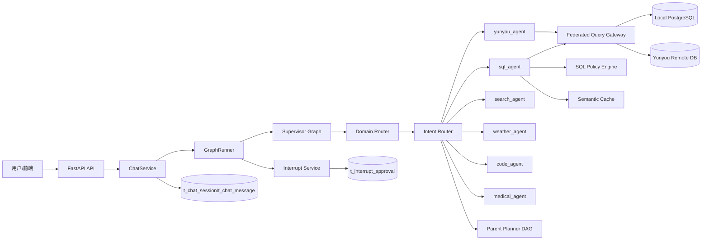

# XF-AI-Agent 后端生产级工作流说明（总览版）

本文档采用与 `YUNYOU_AGENT_WORKFLOW.md` 一致的“**场景化流程文档**”写法，面向真实生产链路，详细描述：

1. 请求如何进入系统并流式返回；
2. Domain Router / Intent Router 如何决策；
3. 审批 `interrupt()` 如何暂停与恢复；
4. PostgreSQL 持久化如何保证状态一致性；
5. 出问题时如何快速定位。

---

## 1. 系统架构概述

系统采用 **FastAPI + LangGraph Supervisor-Worker 多智能体架构**。

- **API层（FastAPI）**：接收请求、鉴权、SSE 输出。
- **服务层（ChatService）**：处理历史消息、启动 GraphRunner、落库聊天结果。
- **图执行层（GraphRunner + Supervisor）**：调度路由、执行子图、处理中断恢复。
- **子智能体层（Agents）**：yunyou/sql/search/weather/code/medical 等领域执行。
- **数据层（PostgreSQL）**：业务表 + 聊天记录 + 审批状态持久化。

### 架构图

---

## 2. 生产运行前提（必须满足）

### 2.1 会话一致性

1. 前端 `session_id` 必须在同一会话内保持稳定。
2. 所有恢复动作都依赖 `session_id` 命中正确图状态。

### 2.2 数据库与迁移

1. PostgreSQL 可连接。
2. 生产推荐 `AUTO_CREATE_TABLES=false`。
3. 发布前执行 `alembic upgrade head`。

### 2.3 审批链路前提

1. `t_interrupt_approval` 表必须存在。
2. 审批状态更新与恢复必须使用同一 `session_id/message_id`。

---

## 3. 全链路工作流详解

## 场景一：普通问题（无需审批）

**用户意图**：普通查询、普通问答、非敏感工具调用。  
**示例**：`“今天郑州天气怎么样？”`

### 阶段 1：请求进入

1. 前端调用 `POST /api/v1/chat/stream`。
2. `chat_service` 读取历史消息，组装模型配置。
3. `graph_runner.stream_run()` 启动图执行，并返回 SSE。

### 阶段 2：路由决策

1. `Domain_Router_Node` 判定数据域（如 `WEB_SEARCH`）。
2. `Intent_Router_Node` 选择 `weather_agent`。

### 阶段 3：子图执行

1. Agent 调用天气工具。
2. 工具结果回到 Agent 生成自然语言答复。
3. GraphRunner 将正文作为 `stream` 事件持续推送。

### 阶段 4：收尾落库

1. `chat_service` 汇总 `stream` 文本。
2. 写入 `t_chat_message`。

---

## 场景二：Holter 业务查询（云柚域）

**用户意图**：查 Holter 最近记录、按 id 倒序前 N 条。  
**示例**：`“查询 holter 最近使用的用户，按 id 倒序前5条”`

### 阶段 1：域优先路由

1. Domain Router 命中 `YUNYOU_DB`。
2. Intent Router 强约束路由到 `yunyou_agent`。

### 阶段 2：YunyouAgent 快路径

1. `_try_direct_holter_list_query` 识别“列表+排序+TopN”意图。
2. 调用 `federated_query_gateway.query_yunyou_holter_recent(...)`。
3. 优先直连远端业务库 `t_holter_use_record`。

### 阶段 3：结果格式化

1. 将返回数据格式化为用户可读 Markdown 表格。
2. 若直连失败，回退云柚 API，并给出说明。

---

## 场景三：SQL 审批链路（原生 interrupt）

**用户意图**：执行本地 SQL 查询（属于高风险操作）。  
**示例**：`“查询 t_user_info 按 id 倒序前5条”`

### 阶段 1：触发中断

1. 路由到 `sql_agent`。
2. SQL 生成后，`execute_sql` 节点调用 `interrupt(payload)`。
3. GraphRunner 捕获中断并注册审批：
   - 写入 `t_interrupt_approval`，`status=pending`。
4. 前端收到 SSE `interrupt` 并展示“批准/拒绝”。

### 阶段 2：用户审批

#### 分支 A：批准

1. 前端调用审批接口（或触发恢复请求）。
2. `interrupt_service` 将状态更新为 `approve`。
3. GraphRunner 检测到可恢复审批，发送 `Command(resume="approve")`。
4. 子图继续执行 SQL，返回结果。
5. 标记 `is_consumed=true`。

#### 分支 B：拒绝

1. 状态更新为 `reject`。
2. 恢复后跳过敏感执行，返回“已拒绝/已取消”。
3. 同样执行消费标记，避免重复恢复。

---

## 场景四：复杂任务（DAG 编排）

**用户意图**：一个问题中包含多任务、多依赖。  
**示例**：`“先查用户数据，再对异常用户做搜索验证，最后汇总建议”`

### 阶段 1：Parent Planner 拆解任务

1. 生成 `task_list`（带依赖关系）。
2. 标记可并行与串行任务。

### 阶段 2：Dispatcher + Worker 并行执行

1. Dispatcher 选择当前波次可执行任务。
2. Worker 并行调用对应 Agent。
3. Reducer 汇总结果，推进下一波次。

### 阶段 3：Aggregator 汇总答复

1. 聚合所有任务产物。
2. 输出最终统一回答。

---

## 4. 路由策略（防误路由核心）

### 4.1 Domain Router 规则

优先级：

1. 历史补充句继承（follow-up carry-over）。
2. 关键字规则。
3. LLM 分类兜底。

目标：先确定数据域，再确定 Agent，避免“问云柚却查本地聊天表”。

### 4.2 Intent Router 规则

1. 在域约束内选 Agent。
2. `holter` 语义优先 `yunyou_agent`。
3. SQL 语义（order by/limit/数据库）优先 `sql_agent`。
4. 长句解析失败时优先进入 Planner，避免直接空答。

---

## 5. 审批状态模型（PostgreSQL）

表：`t_interrupt_approval`

关键字段：

- `session_id`
- `message_id`
- `status`（pending/approve/reject）
- `checkpoint_id/checkpoint_ns`
- `subgraph_thread_id`
- `is_consumed`

作用：

1. 跨请求恢复审批；
2. 防重复恢复；
3. 审计审批轨迹。

---

## 6. SSE 前后端协议（运行时）

系统输出主要事件：

- `response_start`
- `thinking`
- `stream`
- `interrupt`
- `error`
- `response_end`

要求：

1. 无论成功/失败都必须有可感知输出。
2. 超时与异常必须走 `error`，不能静默卡住。

---

## 7. 生产回归清单（推荐）

1. Holter 请求命中 `yunyou_agent`。
2. SQL 请求进入审批并可恢复。
3. 批准后结果能正常输出并消费审批状态。
4. 拒绝后能返回取消信息。
5. 搜索类“今天/明天”日期解释正确。
6. SSE 始终返回 `response_end`。
7. 路由指标接口 `/api/v1/metrics/router` 正常。

---

## 8. 常见故障定位

### 8.1 有思考无最终答复

检查：

1. GraphRunner 是否输出 `stream`。
2. 子图是否返回了 AI 正文消息。
3. 前端是否只渲染 thinking 未渲染 stream。

### 8.2 审批后提示找不到中断任务

检查：

1. `t_interrupt_approval` 目标记录是否存在。
2. `status` 是否为 `approve/reject`。
3. `is_consumed` 是否被提前置为 `true`。
4. `subgraph_thread_id/checkpoint` 是否齐全。

### 8.3 问云柚却查本地库

检查：

1. Domain Router 是否识别为 `YUNYOU_DB`。
2. Intent Router 是否被 SQL 规则错误抢占。
3. 云柚技能/提示词是否被覆盖。

---

## 9. 核心代码路径索引

- 主入口：`app/main.py`
- 聊天服务：`app/services/chat_service.py`
- 图执行器：`app/agent/graph_runner.py`
- 主图：`app/agent/graphs/supervisor.py`
- 云柚 Agent：`app/agent/agents/yunyou_agent.py`
- SQL Agent：`app/agent/agents/sql_agent.py`
- 查询网关：`app/agent/gateway/federated_query_gateway.py`
- SQL 策略：`app/agent/policy/sql_policy_engine.py`
- 审批服务：`app/services/interrupt_service.py`
- 路由指标：`app/services/route_metrics_service.py`
- 语义缓存：`app/services/semantic_cache_service.py`

---

*文档生成时间: 2026-03-08*
