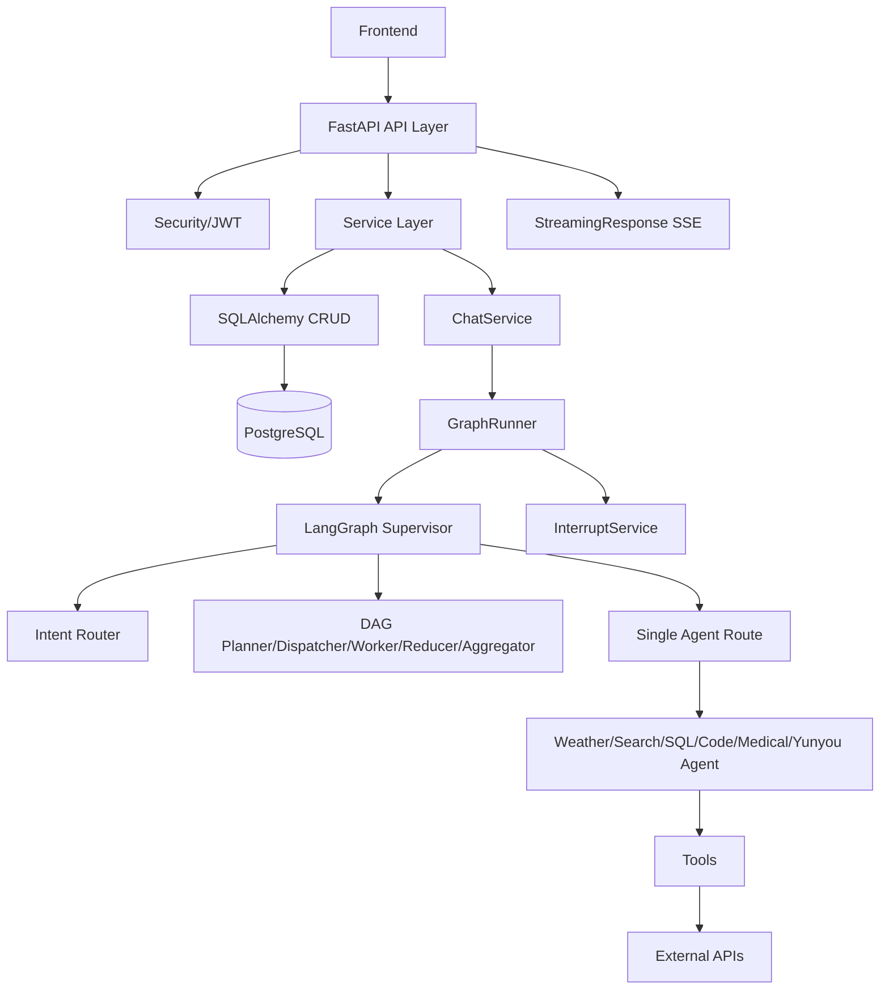
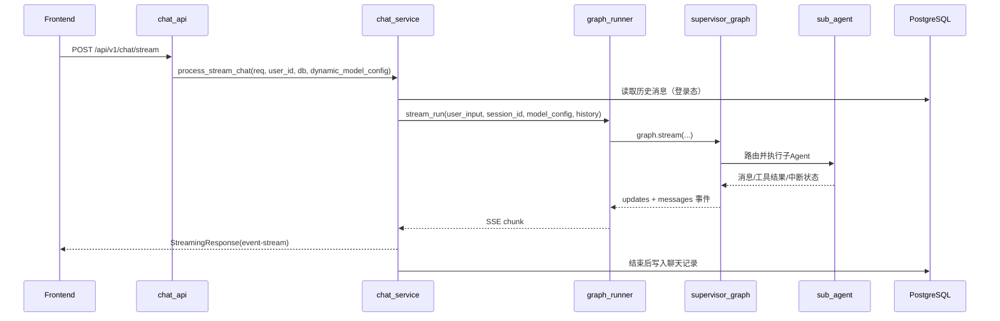

# XF-AI-Agent 后端项目学习文档（小白友好 + 深度版）

> 文档目标：让你从 0 开始能读懂这个后端项目的“架构、流程、逻辑、技术选型、注解/装饰器”。
> 代码基线：以当前 `xf-ai-agent` 目录里的实际代码为准。

---

## 1. 这是什么项目？一句话先说清

这是一个 **基于 FastAPI + LangGraph + LangChain + PostgreSQL** 的智能体后端系统。

它做的事情可以概括为：
1. 提供标准 REST API（用户、模型配置、聊天历史等）。
2. 提供流式聊天接口（SSE），把模型输出“边生成边推给前端”。
3. 内部用 Supervisor 图调度多个专业 Agent（天气、搜索、SQL、代码、医疗、云柚业务）。
4. 支持“人工审批中断”（例如 SQL 执行、敏感工具调用，先审批再继续执行）。
5. 支持规则引擎前置拦截 + RAG 检索增强 + 用户自定义模型配置。

---

## 2. 项目整体架构（先看大图，再看细节）



### 2.1 分层理解（非常重要）

1. **API 层**：只接 HTTP 请求，做参数接收、鉴权依赖注入、调用 service。
2. **Service 层**：业务逻辑核心（例如聊天流处理、用户注册登录、模型配置管理）。
3. **数据访问层（CRUD）**：统一封装数据库增删改查。
4. **Agent 调度层（LangGraph）**：复杂对话逻辑与多智能体执行。
5. **工具层**：搜索、天气、SQL 执行、业务 API 查询等。
6. **基础设施层**：日志、中间件、配置、JWT、checkpointer（会话状态持久化）。

---

## 3. 目录结构（按“真正有用”解释）

```text
xf-ai-agent/
├── main.py                      # 进程启动入口，uvicorn.run
├── pyproject.toml               # 依赖和构建配置
├── .env / .env.example          # 环境变量
├── app/
│   ├── main.py                  # FastAPI 应用创建、路由注册、异常处理中枢
│   ├── core/                    # 中间件、安全、日志
│   ├── api/v1/                  # 所有 HTTP 接口
│   ├── services/                # 业务逻辑层
│   ├── db/                      # SQLAlchemy 引擎、Session、CRUD
│   ├── models/                  # SQLAlchemy ORM 表模型
│   ├── schemas/                 # Pydantic 请求/响应模型
│   ├── agent/                   # LangGraph 核心（Supervisor + 各 Agent）
│   └── utils/                   # 工具方法（JWT、SSE、日志、日期、装饰器）
├── mcp/                         # MCP 相关示例
├── logs/                        # 运行日志
└── data / vectorstore           # 知识库及向量库相关资源
```

---

## 4. 技术栈与用途（不是罗列，是“在哪里用”）

## 4.1 Web/API

1. **FastAPI**：定义路由、依赖注入、异常处理、中间件。
2. **Uvicorn**：ASGI 服务启动。
3. **Starlette StreamingResponse**：SSE 流式返回。

## 4.2 AI/Agent

1. **LangChain**：模型封装、Prompt、Tool、消息对象。
2. **LangGraph**：状态图编排（Supervisor + 子图 Agent）。
3. **LangGraph Checkpointer**：对话状态持久化（当前主要用 Postgres Saver）。

## 4.3 数据层

1. **SQLAlchemy**：ORM + Session + 事务。
2. **PostgreSQL**：主业务库（用户、模型配置、会话历史）。
3. **PGVector + LangChain Postgres**：向量检索存储。

## 4.4 安全与配置

1. **PyJWT**：生成/解析 access token、refresh token。
2. **Passlib + bcrypt**：密码哈希与验证。
3. **python-dotenv**：`.env` 配置读取。

## 4.5 外部工具/API

1. **Tavily**：联网搜索。
2. **和风天气 API**：天气查询。
3. **云柚业务 API**：Holter 业务查询。

---

## 5. FastAPI 启动与请求入口

### 5.1 启动链

1. `main.py`：`uvicorn.run(app, host="0.0.0.0", port=8000)`。
2. `app/main.py`：
   - 初始化日志。
   - `Base.metadata.create_all(bind=engine)` 自动建表。
   - 注册异常处理器。
   - 注册中间件。
   - 注册 `/api/v1` 路由。

### 5.2 全局异常处理

在 `app/main.py` 里统一处理：
1. `BusinessException`
2. `HTTPException`
3. 未知 `Exception`

统一返回 `ResponseModel.fail(...)`，这样前端拿到的是统一结构：`code/message/data`。

---

## 6. 中间件逻辑（你项目很关键的一层）

文件：`app/core/middleware.py`

### 6.1 `ProcessTimeMiddleware`

作用：
1. 给请求生成 `X-Request-Id`。
2. 记录请求开始/结束日志。
3. 响应头注入 `X-Process-Time`（耗时）。

### 6.2 `DynamicModelMiddleware`

只对 `/api/v1/chat*` 生效。

作用：
1. 从请求 body 提取 `user_model_id`。
2. 去数据库找用户模型配置。
3. 解析为统一模型参数字典并挂到 `request.state.model_config`。
4. 后续 `chat_service` 直接拿 `request.state.model_config` 使用。

这一步的好处：
- API 层和 ChatService 不用重复写“模型配置解析”的代码。

---

## 7. API 层接口总览（v1）

统一前缀：`/api/v1`

## 7.1 聊天

1. `POST /chat/stream`（登录态）
2. `POST /chat/stream/anonymous`（匿名）

核心：返回 `text/event-stream`。

## 7.2 聊天历史

1. `POST /chat-history/save-session`
2. `POST /chat-history/sessions`
3. `GET /chat-history/sessions`
4. `GET /chat-history/sessions/{session_id}/messages`
5. `POST /chat-history/messages`

## 7.3 用户

1. `POST /user/create`
2. `POST /user/login`
3. `GET /user/detail`
4. `PUT /user/update`
5. `POST /user/change-password`

## 7.4 模型设置

1. `GET /model_setting/`
2. `POST /model_setting/`
3. `PUT /model_setting/{service_id}`
4. `DELETE /model_setting/{service_id}`
5. `POST /model_setting/{service_id}/test`
6. `PUT /model_setting/{service_id}/toggle`

## 7.5 用户模型

1. `GET /user_model/`
2. `POST /user_model/`
3. `PUT /user_model/{model_id}`
4. `PUT /user_model/{model_id}/activate`
5. `PUT /user_model/{model_id}/deactivate`
6. `GET /user_model/active`
7. `DELETE /user_model/{model_id}`

## 7.6 用户 MCP

1. `GET /user_mcp/`
2. `POST /user_mcp/`
3. `PUT /user_mcp/{mcp_id}`
4. `DELETE /user_mcp/{mcp_id}`

## 7.7 人工审批

1. `POST /interrupt/approve`

---

## 8. 聊天主流程（最核心，建议反复看）

### 8.1 从请求到 SSE 的调用链



### 8.2 `ChatService` 关键职责

文件：`app/services/chat_service.py`

1. 构建模型配置（优先用中间件注入配置）。
2. 读取历史消息并标准化。
3. 调用 `GraphRunner.stream_run()` 获取事件流。
4. 对流进行解析：
   - 收集 AI 正文（用于落库）
   - 捕获异常并转 SSE error
5. 结束时保存一条聊天消息（包括 tokens、latency）。

### 8.3 SSE 事件类型（前端要识别这些）

常见类型：
1. `response_start`
2. `thinking`
3. `stream`
4. `interrupt`
5. `error`
6. `response_end`

---

## 9. GraphRunner 与 Supervisor 图（系统大脑）

文件：`app/agent/graph_runner.py`、`app/agent/graphs/supervisor.py`

## 9.1 GraphRunner 做了什么

1. 计算配置 hash，缓存编译好的 supervisor 图，避免重复构图。
2. 先检查是否有“审批结果待恢复”（`_check_pending_approval`）。
3. 执行规则引擎前置拦截（短句高频意图直接返回，不走大模型）。
4. 可选 RAG 检索并注入 SystemMessage。
5. 启动后台线程跑 `graph.stream`，主线程实时出队列推 SSE。
6. 扫描子图中断状态，转成 `interrupt` 事件发给前端。

## 9.2 Supervisor 的 3 层决策

### Tier-0：规则引擎（Graph 外）

- 配置来源：`app/config/rules.yaml`
- 代码：`agent/rules/registry.py` + `agent/rules/actions.py`
- 典型：问日期/时间/问候等，极速返回。

### Tier-1：Intent Router（轻量意图路由）

- 节点：`intent_router_node`
- 任务：判断 `intent/confidence/is_complex/direct_answer`
- 复合意图会走 Tier-2。

### Tier-2：复杂任务 DAG

节点链：
1. `parent_planner_node`（拆任务）
2. `dispatcher_node`（分波次发可并行任务）
3. `worker_node`（执行单子任务）
4. `reducer_node`（回收结果/更新状态）
5. `aggregator_node`（最终汇总）

如果是简单高置信单意图，会直接走单兵 Agent（如 `weather_agent`）。

---

## 10. 子 Agent 逐个解读

## 10.1 CodeAgent

- 流程：生成代码 -> 人工审批 -> 执行代码 -> 结果总结。
- 关键点：使用 `interrupt(...)` 提交审批请求。
- 工具：`execute_python_code`。

## 10.2 SqlAgent

- 流程：取 schema -> 生成 SQL -> 审批 -> 执行 -> 总结。
- 状态字段：`pending_interrupt`。
- 审批通过后用 `Command(update=...)` 恢复图执行。

## 10.3 WeatherAgent

- 大模型绑定 `get_weathers` 工具。
- 根据 `tools_condition` 决定是否调用工具。

## 10.4 SearchAgent

- 大模型绑定 `tavily_search_tool`。
- 循环 `agent -> tools -> agent` 直到无需工具。

## 10.5 MedicalAgent

- 医疗问答 + 固定免责声明追加。

## 10.6 YunyouAgent

- 云柚业务工具：`holter_list / holter_type_count / holter_report_count`。
- 敏感工具（默认 `holter_report_count`）必须审批。
- 支持可配置技能中间件（`ConfigurableSkillMiddleware`）。

---

## 11. 人工审批中断机制（Interrupt）

### 11.1 为什么需要它

防止高风险动作直接执行，比如：
1. 执行 SQL
2. 执行代码
3. 访问敏感业务接口

### 11.2 流程

1. 子 Agent 把审批请求写入状态 `pending_interrupt`。
2. `GraphRunner` 扫描到后推 SSE `interrupt` 给前端。
3. 前端调用 `/api/v1/interrupt/approve` 提交 `approve/reject`。
4. `InterruptService` 记录审批状态。
5. 前端再次发 `[RESUME]` 请求。
6. `GraphRunner._handle_resume` 恢复挂起子图继续执行。

---

## 12. 数据模型与数据库设计

文件：`app/models/*.py`

## 12.1 主要表

1. `t_user_info`：用户账户。
2. `t_model_setting`：系统模型服务配置。
3. `t_user_model`：用户自己的模型配置（关联模型服务）。
4. `t_user_mcp`：用户 MCP 配置。
5. `t_chat_session`：会话表。
6. `t_chat_message`：消息表（含 `JSONB extra_data` 扩展字段）。

## 12.2 关系

- `ModelSetting (1) -> (N) UserModel`（`relationship(back_populates)`）

## 12.3 ORM 风格

当前项目混用两种写法：
1. 传统 `Column(...)`
2. SQLAlchemy 2.0 `Mapped[...] = mapped_column(...)`

---

## 13. Schema（Pydantic）层怎么工作

文件：`app/schemas/*.py`

1. 请求参数校验（比如 `StreamChatRequest`）。
2. 输出模型标准化（`ResponseModel[T]`）。
3. `from_attributes=True` 支持 ORM 对象直接转 Pydantic。
4. `field_validator` 做字段级业务校验。

典型例子：
- `StreamChatRequest.validate_user_input`：防空字符串、防过长输入。
- `StreamChatRequest.validate_session_id`：校验会话 ID 格式。

---

## 14. Service 层设计模式

### 14.1 BaseService / CRUDBase

提供通用增删改查能力，减少重复代码。

### 14.2 专项服务

1. `UserInfoService`：注册、登录、改密、刷新 token。
2. `ModelSettingService`：系统模型服务维护。
3. `UserModelService`：用户模型管理。
4. `ChatHistoryService`：会话和消息存储。
5. `ChatService`：流式聊天总协调。
6. `InterruptService`：审批状态内存管理。

---

## 15. 认证与安全

文件：`app/core/security.py`、`app/utils/pwd_utils.py`

1. 使用 `HTTPBearer` 从 `Authorization: Bearer <token>` 拿凭据。
2. `verify_token` 返回 `user_id`，失败抛 401。
3. 支持 access token + refresh token 双 token 模式。
4. 密码加密使用 `passlib+bcrypt`。
5. 密码强度可配置（长度、复杂度、弱密码检查）。

---

## 16. 配置与环境变量（你部署时最先看这里）

主要来自 `.env` / `.env.example`。

高优先级配置：
1. PostgreSQL：`POSTGRES_HOST/PORT/USER/PASSWORD/DB`
2. JWT：`JWT_SECRET_KEY`
3. 模型服务 Key/URL：`OPENROUTER_API_KEY`、`SILICONFLOW_API_KEY` 等
4. 工具服务：`TAVILY_API_KEY`、`HF_API_KEY`、`YY_BASE_URL`
5. Checkpointer：`CHECKPOINTER_BACKEND`（`postgres`/`memory`）

---

## 17. 日志体系

1. `core/logger.py`：基础 logger 配置，文件滚动。
2. `utils/custom_logger.py`：高级日志，支持推送到 SSE（思考流）。
3. GraphRunner 里将日志与图事件统一写入队列，前端能实时看过程。

---

## 18. “注解/装饰器”详细解释（重点章节）

你特别点名的 `@abstractmethod`、`@classmethod`、`@functools.wraps(func)` 都在这里。

## 18.1 `@abstractmethod`

位置：`app/agent/base.py`

作用：
1. 声明“抽象方法”，子类必须实现。
2. `BaseAgent` 强制所有具体 Agent 都实现 `_build_graph()`。

为什么好：
- 避免某个 Agent 忘记实现核心方法而在运行期才报错。

---

## 18.2 `@classmethod`

位置示例：
1. `app/schemas/response_model.py` 的 `success/fail`
2. `app/agent/llm/unified_loader.py` 的 `load_chat_model/load_embedding_model`

作用：
1. 第一个参数是 `cls`（类本身），不是实例 `self`。
2. 适合做“工厂方法”或“类级别构造逻辑”。

为什么这个项目用它：
- 统一模型加载入口，避免你先创建实例再调用。

---

## 18.3 `@functools.wraps(func)`

位置：`app/utils/decorators.py`

作用：
1. 保留被装饰函数的元信息（函数名、文档、注解等）。
2. 不加的话，调试和日志里函数名会变成 `wrapper`，不利于排错。

为什么重要：
- 这个项目有错误处理和执行日志装饰器，如果不保留元信息，排查问题会很痛苦。

---

## 18.4 `@contextmanager`

位置：`app/db/__init__.py`

作用：
1. 把函数变成上下文管理器，可 `with get_db_context() as db:` 使用。
2. 自动处理 commit/rollback/close。

为什么好：
- 防止连接泄漏，保证异常时自动回滚。

---

## 18.5 FastAPI 路由装饰器

位置：`app/api/v1/*.py`、`app/main.py`

例如：
1. `@router.get`
2. `@router.post`
3. `@router.put`
4. `@router.delete`
5. `@app.exception_handler`

作用：
- 把 Python 函数注册为 HTTP 接口或异常处理器。

---

## 18.6 `@field_validator`（Pydantic v2）

位置：`app/schemas/chat_schemas.py`

作用：
- 对字段做精细校验，例如 `user_input`、`session_id`。

意义：
- 把“脏数据拦截”放在模型层，减少业务层防守代码。

---

## 18.7 `@model_validator`（Pydantic v2）

位置：`app/agent/rules/registry.py`

作用：
- 模型构建后执行校验/处理。
- 这里用于正则 `patterns` 预编译缓存，提高匹配性能。

---

## 18.8 `@staticmethod`

分布广泛（`ChatUtils`、`GraphRunner`、`BusinessExceptionHandler` 等）。

作用：
- 与类有关但不依赖实例状态，逻辑收纳到类内更清晰。

---

## 18.9 `@property`

位置：`app/agent/llm/model_config.py`

作用：
- 把方法当属性访问（`config.extra_params`），兼容旧调用方式。

---

## 18.10 `@tool`（LangChain 工具装饰器）

位置：
1. `agent/tools/search_tools.py`
2. `agent/tools/weather_tools.py`
3. `agent/tools/yunyou_tools.py`
4. `utils/code_tools.py`

作用：
- 把普通函数包装成大模型可调用的工具。

工具调用链：
- LLM 输出 tool_call -> `ToolNode` 执行 -> 工具结果回到消息流。

---

## 18.11 你项目里常见“类型注解”解释（不是装饰器，但同样重要）

### `TypedDict`

用于定义图状态结构（如 `GraphState`、`SqlAgentState`）。

### `Annotated`

例如：`messages: Annotated[List[BaseMessage], add_messages]`

含义：
- 附加元信息（这里告诉 LangGraph 如何聚合 messages）。

### `Mapped[...]`

SQLAlchemy 2.0 ORM 强类型字段声明。

### `TypeVar/Generic`

用于泛型 CRUD/Service，提升复用和类型安全。

### `Optional[...]`

字段可空。

---

## 19. 新手最容易卡住的 10 个点

1. 为什么 chat 接口是流式不是一次性 JSON？
- 因为要实时展示生成过程、工具调用、思考日志。

2. 为什么有 API 层还要 Service 层？
- 分层解耦，便于测试和复用。

3. 为什么需要 Checkpointer？
- 要支持中断后恢复（审批场景）、多轮记忆。

4. 为什么要规则引擎 + LLM 双路？
- 高频简单请求走规则更快更省成本。

5. 为什么有 `dynamic_model_config`？
- 用户每次可选不同模型卡片，不应写死模型。

6. `session_id` 为什么必须规范？
- 它是会话隔离和状态恢复的关键索引。

7. 为什么中断审批需要 `[RESUME]`？
- 因为图执行已经挂起，需要显式恢复信号。

8. 为什么要统一 `ResponseModel`？
- 前端处理更稳定，异常与成功结构一致。

9. 为什么 `extra_data` 用 JSONB？
- 工具结果结构变化大，JSONB 扩展性更强。

10. 为什么日志要能推到 SSE？
- 对调试 Agent 工作流非常有用，能看到“过程”而不仅结果。

---

## 20. 当前代码中的“阅读注意点”（帮助你避免误解）

1. 项目里有部分历史/实验文件（例如部分 test、旧方案工具），阅读时以 `app/main.py` + `app/api/v1` + `app/services` + `app/agent` 主链为准。
2. `app/dependencies.py` 当前是空文件，可视为预留。
3. `user_model_api.py` 中存在调用的服务方法（如 `deactivate/remove`）在当前 `user_model_service.py` 未完整实现，属于代码演进中的不一致点。
4. `sql_tools.py` 里 `SHOW TABLES`/`SHOW COLUMNS` 偏 MySQL 风格，而主库当前是 PostgreSQL，这部分要按实际库方言调整。
5. `vector_store.py` 默认写了本地 Ollama Embedding（`bge-m3`），部署到服务器前需确认是否有对应模型服务。

---

## 21. 本地启动与调试建议（最实用）

1. 准备 `.env`：至少把数据库、JWT、模型 API Key 补齐。
2. 安装依赖：`uv pip install .`
3. 启动服务：`python main.py` 或 `uvicorn main:app --reload --port 8000`
4. 打开文档：`http://127.0.0.1:8000/docs`
5. 先测：
   - `/api/v1/user/create`
   - `/api/v1/user/login`
   - `/api/v1/chat/stream`
6. 看日志：`logs/*.log`

---

## 22. 如何继续扩展这个项目（你后续开发路线）

### 22.1 新增一个 Agent

1. 在 `app/agent/agents/` 新建类，继承 `BaseAgent`。
2. 实现 `_build_graph()`。
3. 在 `app/agent/registry.py` 注册 `agent_classes`。
4. 更新 supervisor prompt（让路由器知道新 agent 能力）。

### 22.2 新增一个 Tool

1. 写函数并加 `@tool`。
2. 在对应 agent 的 `tools` 列表中绑定。
3. 如有风险，接入审批中断逻辑。

### 22.3 新增一个普通业务接口

1. `schemas` 定义请求/响应。
2. `services` 写业务。
3. `api/v1` 暴露路由。
4. `main.py` 注册路由（如果是新 router）。

---

## 23. 总结（你现在应该掌握什么）

如果你把这份文档和代码对照一遍，你应该已经能：

1. 说清楚这个项目每一层在做什么。
2. 从一个聊天请求一路追踪到 LangGraph 子图执行。
3. 理解为什么要有中断审批与恢复。
4. 看懂项目里各种注解/装饰器的真实用途。
5. 独立完成“新增一个 Agent / Tool / API”的开发。

如果你愿意，我下一步可以再给你做一版《7 天上手计划》：每天读哪些文件、做哪些改造、如何最小成本跑通全链路。
